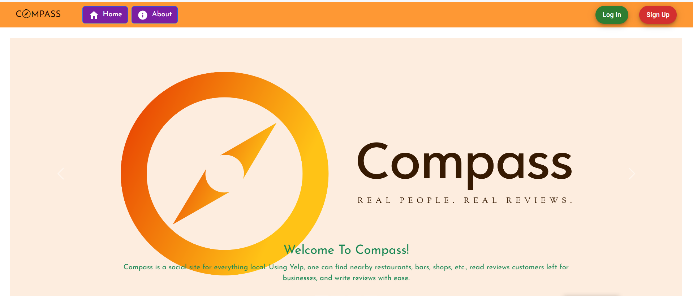
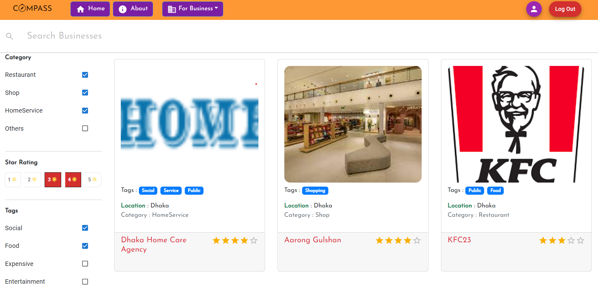
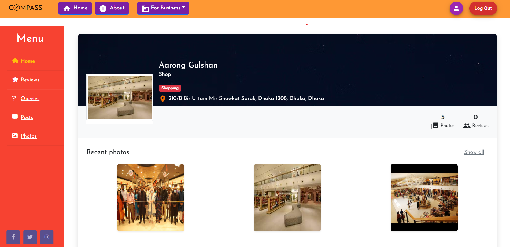
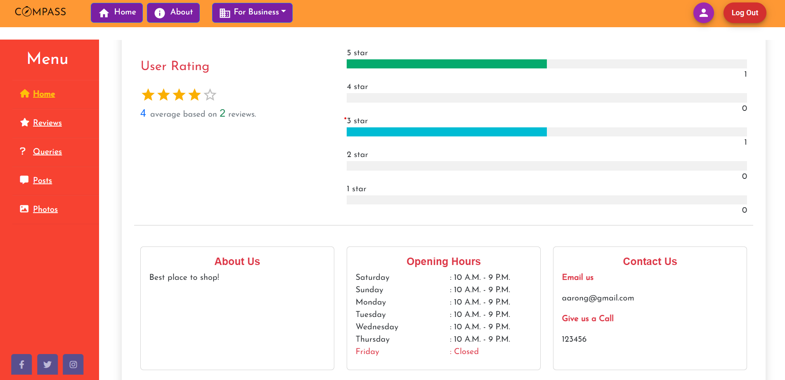
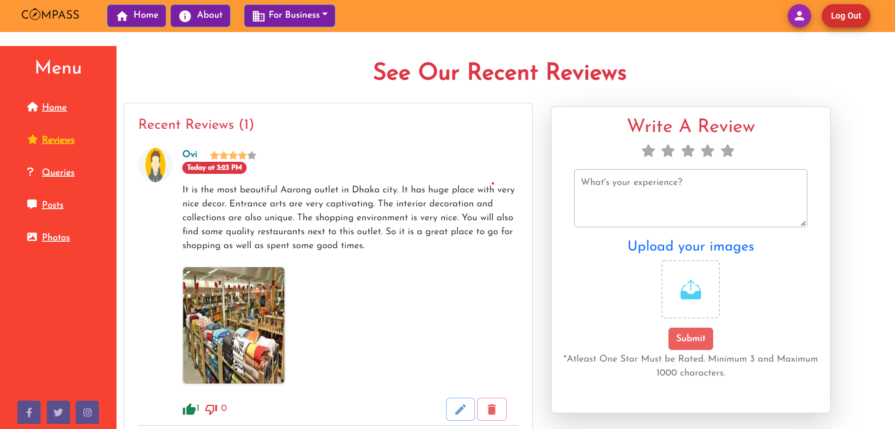
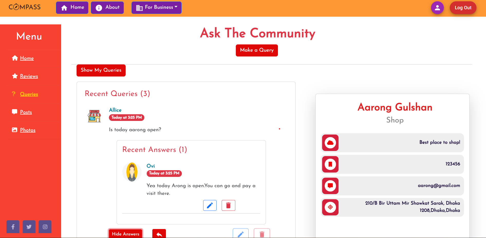
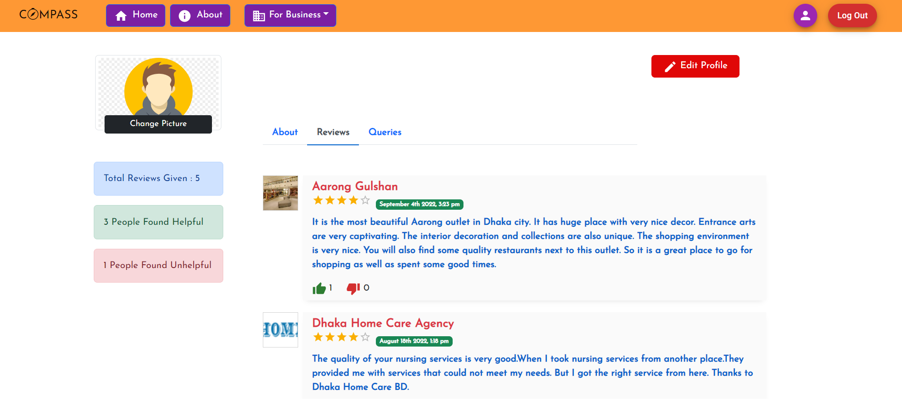

# About Compass

This project is to make a "YELP" like site.

Compass is a review site for marketing local businesses.
When you sign up, you can find the best businesses in town.

There are lists of restaurants, hotels, homeservices, and shops. Curious about that new restaurant down the block?
You can check Compass to read customer reviews and get information from customer queries.

Being on Compass, also helps you attract new customers and address existing customers' feedback to improve your company.


# Installation Process

While Installing React(Front End Part), Vulnerabilites may arise due to dependencies errors.
Running `npm install` will not eliminate vulnerabilities completely. Don't be worried about it.
Just Ignore them and run the following commands.

```
    npm config set legacy-peer-deps true
    npm install
    npm start
```

# Compass Landing Page

<p align="center">
  
</p>

# HomePage For Searching Businesses
<p align="center">
  
</p>

# Business Home Page
<p align="center">
  
</p>
<p align="center">
  
</p>

# Business Reviews Page
<p align="center">
  
</p>

# Busienss Queries Page
<p align="center">
  
</p>

# User Profile Page
<p align="center">
  
</p>